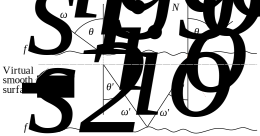
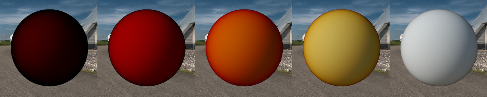
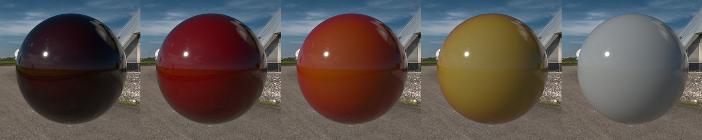
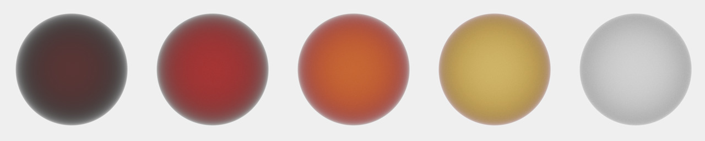
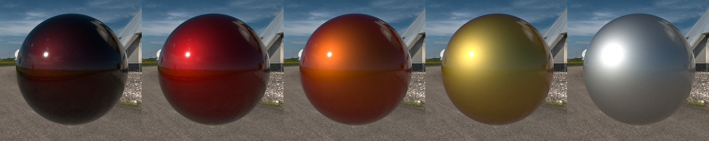

This is a chapter of the blog post series [Rendering Layered Materials](rendering-layered-materials.html).

Here I present my approach to the layered surface material as an alternative to the [layered model by Andrea Weidlich and Alexander Wilkie](rendering-layered-materials-weidlich-wilkie-layered-model.html) from 2007 (which I refer to as *the original model or* the WWL model). This chapter contains: an overall explanation of my model, its evaluation and sampling process, and a few examples result images.

## Overall Model Description

At first sight, my layered model doesn't differ very much from the WWL model, but it contains *important incremental* improvements, which solve *some/critical?/various/several* problems of the previous model and offers a rigorous formulation of the model consistent with radiometry*/(BSDF)* framework and Monte Carlo theory. Namely, the improvements are:

- Using **geometric normal** for refraction instead of micro-facet's one.
- Adding the missing compensation of **solid angle (de-)compression** effects in both evaluation and sampling -- solves the energy conservation problem and incorrect sampling PDF leading to a biased Monte-Carlo estimator.
- *(reworked and more efficient?, ...)* **sampling strategy optimization**.

The model has two main parameters -- two stand-alone layer [BSDFs](https://en.wikipedia.org/wiki/Bidirectional_scattering_distribution_function) (outer and inner), which I denote

$$
\begin{eqnarray*}
&f_{s1}^{\ast}\left(x,\omega_{i}\rightarrow\omega_{o}\right)& \\
&f_{s2}^{\ast}\left(x,\omega_{i}\rightarrow\omega_{o}\right)&
\end{eqnarray*}
$$

where $x$ is the surface point at which the model is evaluated, $\omega_{i}$ is the incident light direction, and $\omega_{o}$ is the outgoing light direction. A direction $\omega$ can be expressed as a pair of angles $\left(\phi,\theta\right)$, where $\phi$ is the azimuth and $\theta$ is the inclination, i.e. angle between the direction and the surface normal. For the sake of clarity, I will, from time to time, omit some of the parameters. Note that in the original paper those BSDFs were denoted without asterisk and with $r$ subscript to *signal* that they are just reflective [BRDFs](https://en.wikipedia.org/wiki/Bidirectional_reflectance_distribution_function) rather than BSDFs: $f_{r1}$ and $f_{r2}$.

The resulting model BSDF $f_{s}$ can be vaguely understood as a sum of two *components/sub-BSDFs* representing the *contributions* of the respective layers $f_{s1}$ and $f_{s2}$:

$$
f_{s}\left(\omega_{i}\rightarrow\omega_{o}\right) = f_{s1}\left(\omega_{i}\rightarrow\omega_{o}\right) + f_{s2}\left(\omega_{i}\rightarrow\omega_{o}\right)
$$

I sometimes call the functions $f_{s1}$ and $f_{s2}$ the **contribution BSDFs** or just **contributions**.

The outer layer is expected to be a microfacet-based interface between two media with refractive indices: $\eta_0$ above the outer layer and $\eta_1$ between the outer and inner layer. There is no assumption on the medium below the inner layer.

### Refraction through the geometrical normal

The new model still assumes single-point simplifications of both evaluation and sampling used in the original model, as well as non-scattering behaviour of the medium between layers. However, unlike the WWL model, it doesn't make any assumption about the relative size of micro-facets and layers, which served as a justification for using the reflection-defined micro-facet normal during the whole evaluation and sampling process. The difference of my model is that for computing refraction directions it uses the geometrical normal rather than the micro-facet's one.

*It behaves as if we temporarily shrank the distribution of micro-facets into a Dirac pulse -- super highly specular material. The same amount of energy gets refracted, but in modified (degenerated) set of directions...*

It is *important to keep in mind* that the new model still estimates the whole sub-surface light transport with just one light path and a single scattering event, but the used refraction directions define a path, which is more likely the one through which *the peak amount of energy flows*. This makes it a better representative/estimate of the actual total (single-scattered) energy transferred via all refracted paths. *(Comparisons needed!)*

It is also important to keep in mind that both models neglect the energy which is reflected from the outer layer back into the medium (*multiple scattering*). *WWL model uses some kind of compensation!...*

*Why should my approximation work?... The higher the specularity of the outer surface is the better the approximation behaves. For rougher surfaces the light is spreads over a wider interval of directions --> the Fresnel behaves differently (especially at grazing angles), the inner layer is lit from wider set of angles --> approximation starts to fail... But, at least the amount of transmitted energy should roughly approximate the actual transmission.*

## Evaluation

As mentioned earlier, the model can be understood as a sum of two contribution BSDFs:

$$
f_{s}\left(\omega_{i}\rightarrow\omega_{o}\right) = f_{s1}\left(\omega_{i}\rightarrow\omega_{o}\right) + f_{s2}\left(\omega_{i}\rightarrow\omega_{o}\right)
$$

### Outer layer

The contribution BSDF of the outer layer is trivial. It can be split into the reflection and refraction part. The light which gets refracted through the first layer into the model is accounted for in the inner layer component so we ignore it here and the renderer must make sure that it is not evaluated for directions below surface. Since the reflected light is unaffected by the rest of the model and the whole model takes only reflection directions into account, it can be evaluated directly by evaluating the outer layer BSDF $f_{s1}^{\ast}$ *without any modification*. Therefore:

$$
f_{s1}\left(\omega_{i}\rightarrow\omega_{o}\right) = f_{s1}^{\ast}\left(\omega_{i}\rightarrow\omega_{o}\right)
$$

 
Reflection contribution of a highly glossy micro-facet outer layer (Smith micro-surface profile, GGX distribution with roughness 0.01, air-glass interface) under various light settings (constant light, large light source, small light source).

### Inner layer

For the inner layer, the things are considerably more complicated because the light which reaches it undergoes refraction when passing the outer layer, gets attenuated by the medium between the layers and gets refracted again when passing the model through the outer layer for the second time. Let's have a look at how do these mechanisms affect the inner layer contribution one after another.

#### Naïve refraction

Let's start with an inner layer (white Lambert) without any modifications, which will undergo the aforementioned modifications later on. BSDF is the original one:

$$
f_{s2}^{\ast}\left(\omega_{i}\rightarrow\omega_{o}\right)
$$

 
Plain, ideally white Lambert without any modifications under various light settings.

*TODO: Use 95% Lambert to see something geometry in the furnace test?*

The inner layer, in fact, *deals* with refracted directions $\omega_{i}^{\prime}$ and $\omega_{o}^{\prime}$ instead of the directions at the outer layer $\omega_{i}$ and $\omega_{o}$ as can be seen in the *image [#RefrGeom]*. After applying  the modified directions, the inner layer contribution will look like this:

$$
f_{s2}^{\ast}\left(\omega_{i}^{\prime}\rightarrow\omega_{o}^{\prime}\right)
$$

 
Ideally white Lambert with refracted directions under various light settings. Since Lambert model is a constant BSDF, changing directions doesn't change the shape of the BSDF in the upper hemisphere; therefore, the behaviour is identical to the version with unmodified directions.

*This seemingly doesn't change anything... lambert is constant -- no change in BSDF shape in the positive hemisphere...we stick with Lambert for simplicity...we'll get to different configurations later...*

The light passing through the smooth interface gets attenuated according to the Fresnel equations, which attenuates the light at grazing angles:

$$
f_{s2}^{\ast}\left(\omega_{i}^{\prime}\rightarrow\omega_{o}^{\prime}\right) T\left(\theta_{i}\right) T\left(\theta_{o}\right)
$$

Where $T\left(\theta_{i}\right)$ and $T\left(\theta_{o}\right)$ are the Fresnel transmission coefficients.

 
Ideally white Lambert with refracted directions and Fresnel attenuation under various light settings.

#### Medium attenuation

After refraction, we will add the effect of medium attenuation. In a non-scattering medium, the attenuation $a$ can be well modeled with the [Beer-Lambert-Bouguer law](https://en.wikipedia.org/wiki/Beer%E2%80%93Lambert_law), exactly as it was done in the original paper:

$$
a\left(\theta_{i}, \theta_{o}\right)  = e^{-\alpha\left(d\cdot\left(\frac{1}{\cos\theta_{i}^{\prime}}+\frac{1}{\cos\theta_{o}^{\prime}}\right)\right)}
$$

where $\alpha$ is the medium attenuation coefficient, $d$ is the thickness of the layer, and $\theta_{i}^{\prime}$ and $\theta_{o}^{\prime}$ are inclinations of the respective refraction directions. The BSDF is now

$$
f_{s2}^{\ast}\left(\omega_{i}^{\prime}\rightarrow\omega_{o}^{\prime}\right) T\left(\theta_{i}\right) T\left(\theta_{o}\right) a\left(\theta_{i}, \theta_{o}\right)
$$

To demonstrate the effect of medium attenuation I used a purely white diffuse Lambert surface model for the inner layer and a brown medium with decreasing inter-layer thicknesses. You can nicely see the effect of darkening and colour saturation when the light passed through different amounts of medium:

 
 
 Ideally white Lambert layer with refracted directions, Fresnel attenuation and orange medium attenuation with varying medium thickness under various light settings.

*TODO: Without Fresnel?*

#### Proper refraction

Although everything looks pretty straightforward in the previous images, there is a problem of we use a non-constant BSDF for the inner layer:

 
Broken energy conservation due to refracted directions: Glossy inner layer (GGX roughness 0.1) with refracted directions, Fresnel attenuation under orange medium with varying medium thickness under constant lighting.

Although we used a physically-plausible energy-conserving model for the inner layer, the resulting inner layer model is much lighter than one would expect for thick medium. In the furnace test (constant white light configuration) we can clearly see that it reflects more energy than it receives from the environment which is a sign of an energy conservation problem. I spent a non-trivial amount of time to crack this problem, but I won in the end and I gained some important computer graphics knowledge on this way. Long story short: the problem is caused by us neglecting the **compression and decompression of light** when crossing an interface between media with different indices of refraction.

I derived a correct energy-conserving BSDF under a smooth refractive interface with a single scattering event.  For that I dug deeper into the theory of BDSFs in another post called [Energy Conserving BSDF Under a Smooth Refractive Interface](rendering-layered-materials-energy-conserving-BSDF-under-smooth-refractive-interface.html). If you are not feeling nerdy enough, just ignore it :-) It basically says that the only thing our original naïve refraction approach is missing is the (relatively trivial) compensation factor $\frac{\eta_{0}^{2}}{\eta_{1}^{2}}$, which, however, makes the difference:

 
Energy conservation fixed with solid angle compression compensation: Glossy inner layer (GGX roughness 0.1) with refracted directions, Fresnel attenuation under orange medium with varying medium thickness under constant lighting.

The result may now, in fact, look much darker than expected for some settings (especially for highly diffuse models like Lambert), but it is caused by the single scattering nature of our model, which neglects the energy which is reflected from the outer layer from the inside back to the medium:

 
Darkening due to missing multi-scattered energy. Ideally white Lambert inner layer with refracted directions under various light settings.

*It's important to note, that we still use the single-point simplification here as was used in the original WWL paper -- i.e. we assume the incoming and outgoing light to pass through the same point on the outer layer.*

*Mention Mitsuba's version? Even they struggled with it and still don't use the correct BSDF. Maybe after I try its approach practically and show the results...*

#### Inner layer formula

If we put together all the components which affect the inner layer contribution, we'll get the final formula for the inner layer:

$$
f_{s2}\left(\omega_{i}\rightarrow\omega_{o}\right) = f_{s2}^{\ast}\left(\omega_{i}^{\prime}\rightarrow\omega_{o}^{\prime}\right) T\left(\theta_{i}\right) T\left(\theta_{o}\right) \frac{\eta_{0}^{2}}{\eta_{1}^{2}} a\left(\theta_{i}, \theta_{o}\right)
$$

where $f_{s2}^{\ast}\left(\omega_{i}^{\prime}\rightarrow\omega_{o}^{\prime}\right)$ is the stand-alone BSDF of the inner layer, $T\left(\theta_{i}\right)$ and $T\left(\theta_{o}\right)$ are the Fresnel transmission coefficients, $\frac{\eta_{0}^{2}}{\eta_{1}^{2}}$ is the projected solid angle compression compensation and $a$ is the medium attenuation coefficient.

Just a side note: Since we are implicitly assume a rendering system which is not polarization aware, we don't have to worry about the order in which the coefficients are multiplied together. In a polarization-aware system, however, multiplication operations (representing light-matter interaction) would have to be dealt with much more care.

### Whole formula

Just to summarize, the complete BSDF formula containing contributions of both layers is

$$
f_{s}\left(\omega_{i}\rightarrow\omega_{o}\right) = f_{s1}^{\ast}\left(\omega_{i}\rightarrow\omega_{o}\right) + f_{s2}^{\ast}\left(\omega_{i}^{\prime}\rightarrow\omega_{o}^{\prime}\right) T\left(\theta_{i}\right) T\left(\theta_{o}\right) a\left(\theta_{i}, \theta_{o}\right) \frac{\eta_{0}^{2}}{\eta_{1}^{2}}
$$

where $f_{s1}^{\ast}$ and $f_{s2}^{\ast}$ are the stand-alone outer and inner layer [BSDFs](https://en.wikipedia.org/wiki/Bidirectional_scattering_distribution_function), $T \left(\theta_{i}\right)$ and $T\left(\theta_{o}\right)$ are the Fresnel transmission coefficients, $a\left(\theta_{i}, \theta_{o}\right)$ is the medium attenuation (see section "Medium attenuation") and $\frac{\eta_{0}^{2}}{\eta_{1}^{2}}$ is the projected solid angle compression compensation. It's important to notice that the formula is, in fact, just a [BRDF](https://en.wikipedia.org/wiki/Bidirectional_reflectance_distribution_function) rather than BSDF, because it is properly defined only for directions from the upper hemisphere.

The complete model for one type of configuration may look like this:

 
 
 
The whole formula using highly glossy outer layer, ideally white Lambert inner layer and orange medium between them with varying medium thickness under various light settings. *TODO: dark inner layer due to multi-scattering.*

 
 
 
The whole formula using highly glossy outer layer, glossy conductor inner layer and orange medium between them with varying medium thickness under various light settings.

## Sampling

In a [Monte Carlo](https://en.wikipedia.org/wiki/Monte_Carlo_integration)-based (MC) rendering system (e.g. path tracing) a BSDF model needs to provide not only an evaluation formula, but also a direction *sampling strategy* with evaluation of its [PDF](https://en.wikipedia.org/wiki/Probability_density_function). Since the sampling strategy can be partially described by its PDF, it is often sufficient to use the symbol of the PDF to denote the whole strategy (e.g. $p$).

In our layered model we assume that the stand-alone *outer and inner layer* BSDFs $f_{s1}^{\ast}$ and $f_{s2}^{\ast}$ provide their own sampling strategies $p^{\ast}_1$ and $p^{\ast}_2$ respectively, which we will use to build a sampling strategy $p$ for the whole model. Since our BSDF is a simple sum of two slightly modified BSDFs, we can build a reasonably efficient overall sampling strategy $p$ by blending two slightly modified strategies $p^{\ast}_1$ and $p^{\ast}_2$, given that they are reasonably efficient on their own:

$$
p\left(\omega_{i},\omega_{o}\right) = w_{1}p_{1}\left(\omega_{i},\omega_{o}\right) + w_{2} p_{2}\left(\omega_{i},\omega_{o}\right)
$$

where $p_1$ and $p_2$ are the sampling strategies of the respective BSDF layers contributions (modified strategies $p^{\ast}_1$ and $p^{\ast}_2$), $\omega_{i} $ is the (sampled) direction of incident light, $\omega_{o}$ is the (fixed) outgoing light direction and $w_1$ and $w_2$ are the blending coefficients.

First, we'll have a look at separate sampling strategies $p_1$ and $p_2$, then we'll combine them together to obtain $p$.

### Outer layer sampling

Because the outer layer BSDF $f_{s1}^{\ast}$ is evaluated directly without any modification, we can use the original sampling strategy of the outer layer stand-alone BSDF

$$
p_1\left(\omega_{i}, \omega_{o}\right) = p_1^{\ast}\left(\omega_{i}, \omega_{o}\right)
$$

The renderer just has to instruct the sampling routine to draw samples only from the upper hemisphere because we are interested only in the reflected contribution of the layer, not refracted.

### Inner layer sampling

 

Sampling the inner layer contribution component.

Sampling the inner layer component is not hard either, we just have to feed the original strategy of the inner stand-alone BSDF with the refracted version of the outgoing direction and refract the generated incoming direction through the virtual smooth interface back into the outside world. This approach will modify the shape of the original sampling PDF in the same way we modified the shape of the original stand-alone BSDF.

It is possible that the generated direction  is refracted back into the model due to total internal reflection (TIR). The resulting sample in such case is still valid, it must not be discarded and its contribution is zero because our model neglects energy which undergoes multiple scattering events.

Now that we have constructed the sampling routine, we also need to evaluate its PDF. At first sight it seems that we just have to evaluate the original PDF using the refracted directions $\omega_{i}^{\prime}$ and $\omega_{o}^{\prime}$, analogically to the way we modified the original sampling strategy

$$
p_2\left(\omega_{i}, \omega_{o}\right) = p_2^{\ast}\left(\omega_{i}^{\prime}, \omega_{o}^{\prime}\right)
$$

If we feed a MC renderer with such PDF, the result will look like this:

 
Too dark inner layer problem: Glossy conductor inner layer with refracted direction and Fresnel attenuation under various light settings.

As you can see, the result is much darker than it should be. *It's because our PDF is computed incorrectly!* The reason is that the non-uniform change of directions due to refraction changes the solid angular density of directional samples. Since the sampling PDF expresses the density of generated samples with respect to the solid angle measure, we need to compensate the original PDF accordingly to get the correct value.
$$
p_2\left(\omega_{i}, \omega_{o}\right) = p_2^{\ast}\left(\omega_{i}^{\prime}, \omega_{o}^{\prime}\right) \frac{\eta_{0}^2 \cos\theta_{i}}{\eta_{1}^2 \cos\theta^{\prime}_{i}}
$$

This compensation factor is closely related to what happens to radiance when it gets refracted through a smooth interface between two media with different refractive indices. Its application will finally yield the correct PDF values resulting in an unbiased Monte Carlo estimator leading to the correct rendering output:

 
Too dark inner layer problem fixed: Glossy conductor inner layer with refracted direction and Fresnel attenuation under various light settings.

### Sampling both layers

*Naïve approach? One could possibly use some ad-hoc/fixed weighting approach, but to obtain better result, we need to be more sophisticated about it....*

To obtain an efficient MC estimator of the *scattering/rendering* integral, the sampling PDF has to be as proportional to the integrand as possible. Ideally, the sampling PDF should be the normalized version of the integrand. i.e. scaled by a factor to make its integral over the whole sphere equal 1. The integrand in the practically used form is

$$
f_{s}\left(\omega_{i}\rightarrow\omega_{o}\right)L_{i}\left(\omega_{i}\right)\cos\theta_{i}
$$

However, because we usually don't know the distribution of the incident radiance, the sampling routine is usually trying to mimic at least the product of the BSDF and the cosine factor.

$$
f_{s}\left(\omega_{i}\rightarrow\omega_{o}\right)\cos\theta_{i}
$$

In the case of our layered model, the BSDF is a sum of two components so the integrand looks like

$$
f_{s1}\left(\omega_{i}\rightarrow\omega_{o}\right) \cos\theta_{i} + f_{s2}\left(\omega_{i}\rightarrow\omega_{o}\right) \cos\theta_{i}
$$

It would not be *very* reasonable to try to derive a sampling strategy directly for the sum formula because the components are general functions which can be hard to sample even as stand-alone functions and which we have little information about anyway. We will instead build the overall sampling strategy on top of the already existing strategies $p_1$ and $p_2$ just by blending them together. If we can sample and evaluate both $p_1$ and $p_2$, it is easy to sample and evaluate a weighted average of the two

$$
p = w_{1}p_{1} * w_{2}p_{2}
$$

The main question *then* is how to choose the weights to make the resulting PDF as proportional to $f_{s}$ as possible. Ideally, the weights should be proportional to the integrals of respective components and the overall strategy would then be as good as the partial ones. The problem is that the integrals are in general hard to evaluate precisely so we have to resort to an approximation.

#### Outer layer integral

On the outer layer, the light is either reflected from or refracted through the layers micro-facets and we will approximate the amount of reflected light just by the Fresnel reflection coefficient of a smooth interface:

$$
w_{1}^{\ast} = F\left(\theta_{o}\right)
$$

#### Inner layer integral

Let's now recall the inner layer contribution

$$
f_{s2}^{\ast}\left(\omega_{i}^{\prime}\rightarrow\omega_{o}^{\prime}\right) T\left(\theta_{i}\right) T\left(\theta_{o}\right) \frac{\eta_{0}^{2}}{\eta_{1}^{2}} T\left(\theta_{i}\right) a\left(\theta_{i}, \theta_{o}\right)
$$

Let's now approximate its integral

$$
\frac{\eta_{0}^{2}}{\eta_{1}^{2}} T\left(\theta_{o}\right) \int_{\mathcal{H}_{+}^{2}} {T\left(\theta_{i}\right) a\left(\theta_{i}, \theta_{o}\right) f_{s2}^{\ast}\left(\omega_{i}^{\prime}\rightarrow\omega_{o}^{\prime}\right) \cos\theta_{i} \mathrm{d}\omega_{i}}
$$

Note that the components independent from $\omega_{i}$ were moved outside the integral and we integrate only over the upper hemisphere $\mathcal{H}_{+}^{2}$ rather than over the whole sphere $\mathcal{S}^{2}$ because there's no transmission through the inner layer allowed.

While the components outside the integral are easy to evaluate analytically, the integral part is more complicated and has to be approximated. We will start with the partial integral

$$
\int_{\mathcal{H}_{+}^{2}} f_{s2}^{\ast}\left(\omega_{i}^{\prime}\rightarrow\omega_{o}^{\prime}\right) \cos\theta_{i} \mathrm{d}\omega_{i}
$$

We assume that the stand-alone BSDFs can compute their reflectance over the upper hemisphere

$$
\rho_{s2}^{\ast} = \int_{\mathcal{H}_{+}^{2}} f_{s}\left(\omega_{i}\rightarrow\omega_{o}\right)\cos\theta_{i}\mathrm{d}\omega_{i}
$$

and we will use it as an approximation of the partial integral. This is rather inaccurate because $\rho_{s2}^{\ast}$ uses the original directions $\omega_{i}$ and $\omega_{o}$ instead of their refracted versions $\omega_{i}^{\prime}$ and $\omega_{o}^{\prime}$; therefore, the shape of the integrand is not stretched out and also contains the parts which are cut away by the [total internal reflection](https://en.wikipedia.org/wiki/Total_internal_reflection) in our model, which can lead to substantial error especially at grazing angles. However, this approximation contains -- at least partially -- the characteristics of the inner material and is better than nothing.

Both missing components $T\left(\theta_{i}\right)$ and $a\left(\theta_{i}, \theta_{o}\right)$ change the shape of the integrand and have to be taken into account, but their effect is hard to solve analytically. One way to approximate their overall effect is to evaluate them over the mirror reflection path ($\theta_{i} = \theta_{o}$) -- analogically to what we did in evaluating the sub-surface scattering contribution of the whole model -- and pretend they are constant over the whole hemisphere.

After putting everything together, the resulting approximation for the inner layer contribution integral is then

$$
w_{2}^{\ast} = 
\frac{\eta_{0}^{2}}{\eta_{1}^{2}} T^2\left(\theta_{o}\right) a\left(\theta_{o}, \theta_{o}\right) \rho_{s2}^{\ast}
$$

Where $\eta_{1}^{2}$ and $\eta_{0}^{2}$ are refractive indices of the respective media, $T\left(\theta_{o}\right)$ is the Fresnel transmission coefficient, $a\left(\theta_{i}, \theta_{o}\right)$ is the medium attenuation (see the section "Medium attenuation"), and $\rho_{s2}^{\ast}$ is the reflectance of the stand-alone inner layer BSDF.

#### Complete sampling routine

Now that we have the integrals approximations $w_{1}^{\ast}$ and $w_{2}^{\ast}$, we obtain the PDF weights by normalizing the approximations

$$
\begin{eqnarray}
w_{1}&=&\frac{w_{1}^{\ast}}{w_{1}^{\ast} + w_{2}^{\ast}} \\
w_{2}&=&\frac{w_{2}^{\ast}}{w_{1}^{\ast} + w_{2}^{\ast}}
\end{eqnarray}
$$

which define our mighty overall sampling routine

$$
p = w_{1}p_{1} * w_{2}p_{2}
$$

To sample from blended PDF, first randomly pick one of the sampling sub-routines $p_1$ and $p_2$ with probabilities equal to $w_1$ and $w_2$ respectively and then draw sample from the selected sub-routine. To evaluate the probability density of the sample, evaluate the whole PDF $p$.

*[image: Sampling performance: Low sample rate. Just furnace test to isolate the BSDF sampling performance from light sampling. Strategies: fixed ratio?, Fresnel ratio, my approach.]*

## Conclusion

...
